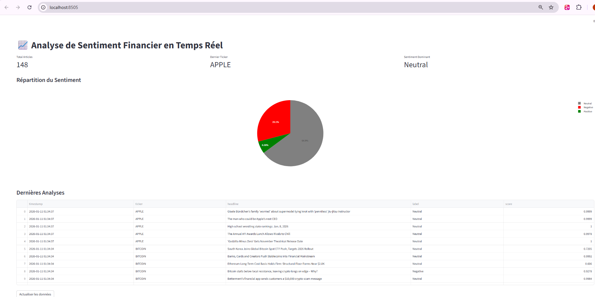

# 📈 FinBERT Market Sentinel


An end-to-end real-time financial sentiment analysis pipeline. This project monitors stock market news, processes them through a specialized Deep Learning model (FinBERT), and visualizes the market "mood" via an interactive dashboard.


##  Features
- **Automated Ingestion**: Real-time news fetching via NewsAPI for major tickers (NVDA, TSLA, AAPL).
- **AI-Powered Analysis**: Uses **FinBERT** (Natural Language Processing) to classify financial headlines into Positive, Negative, or Neutral sentiments.
- **Persistent Storage**: All analyses are stored in a PostgreSQL database.
- **Live Dashboard**: Interactive data visualization using Streamlit and Plotly.
- **Fully Containerized**: Deploy the entire stack with a single command using Docker Compose.

##  Tech Stack
- **Language**: Python 3.9
- **AI/ML**: HuggingFace Transformers (FinBERT)
- **Database**: PostgreSQL 15
- **Frontend**: Streamlit & Plotly
- **Infrastructure**: Docker & Docker Compose

##  Installation & Setup

1. **Clone the repository**
   ```bash
   git clone [https://github.com/YOUR_USERNAME/FinBERT-Market-Sentinel.git](https://github.com/YOUR_USERNAME/FinBERT-Market-Sentinel.git)
   cd FinBERT-Market-Sentinel